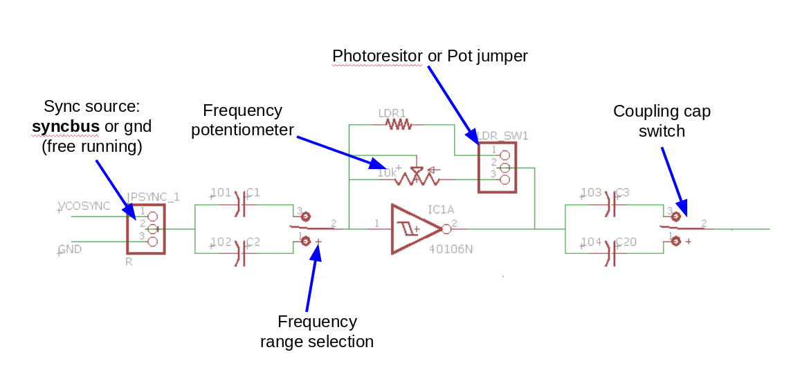

# chaves
Cheap Hacky Audio/Video - Glitch VGA synth based on jonasbers.com/chav/

This is a WIP, and PCBs have not fully tested, if you want to contribute send a build to your favorite pcb provider and give us any feedback.

Pending...

* will generate a bom
* building guide

## Chaves

Its a glitch video synth bassed on CHA/V as stated, but with lots of controls and patcheable pins with the intentions of doing a mini-modular video glitch synth.

Like in the original CHA/V it has 6 VCOs, with selectables ranges, sync sources, frequency and effects outputs (thanks to the coupling caps). Here is a schematic of a single voice

